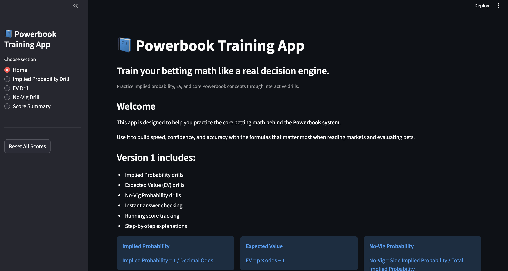
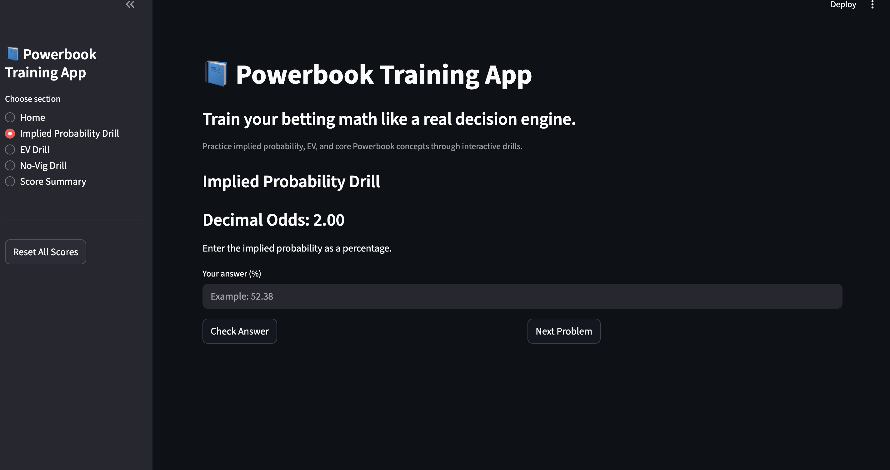
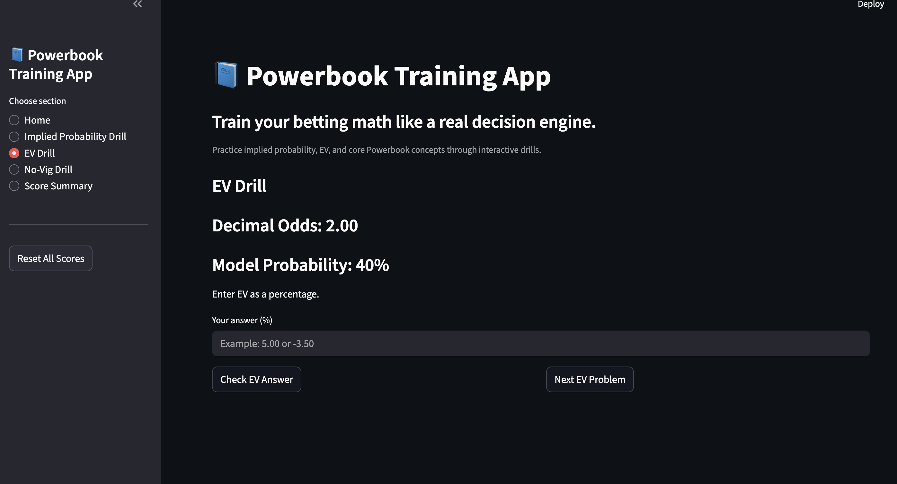
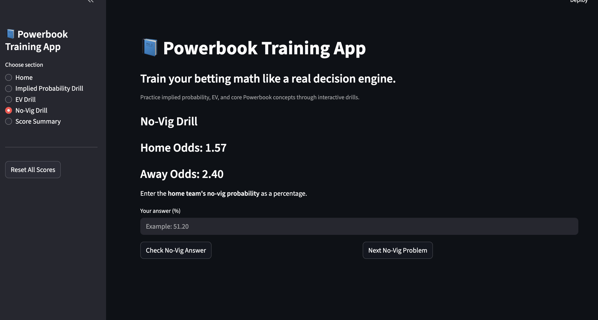
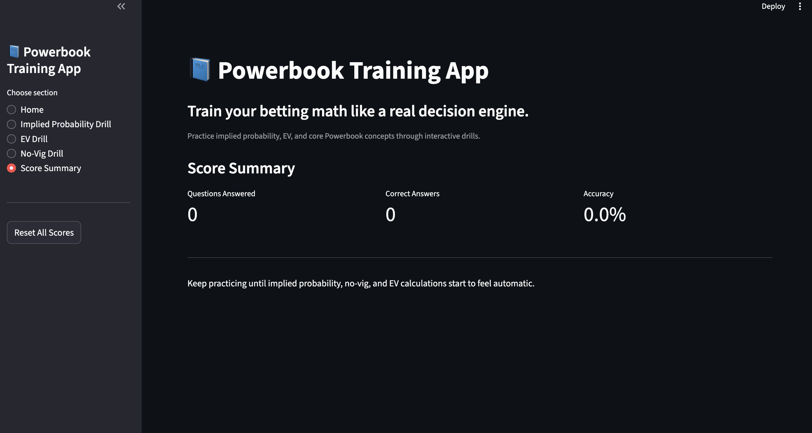

# Powerbook Training App

---

## **Overview**

**Powerbook Training App** is a Streamlit app that helps users practice core sports-betting math through interactive drills.

It was built as part of a larger portfolio of **AI-assisted decision-support and analytics tools**, focused on betting math, market reading, and structured workflow design.

This version trains users on:

- **Implied Probability**
- **Expected Value (EV)**
- **No-Vig Probability**

---

## **Live Skills Practiced**

### **1. Implied Probability**
Convert decimal odds into probability.

**Formula:**
p = 1 / decimal_odds
Example:

Decimal odds: 1.91

Implied probability: 1 / 1.91 = 52.36%

2. Expected Value (EV)

Measure whether a bet has positive or negative value.

Formula: EV = p * odds - 1
Example:

Model probability: 55%

Odds: 2.00
EV = 0.55 * 2.00 - 1
EV = 0.10
EV = 10%
3. No-Vig Probability

Remove sportsbook margin from a two-way market.

Steps:

1.Convert both sides into implied probabilities

2.Add them together

3.Divide one side by the total implied probability

Example:

Home odds: 1.91

Away odds: 1.91
home_implied = 1 / 1.91
away_implied = 1 / 1.91
total_implied = home_implied + away_implied
home_no_vig = home_implied / total_implied

Features

interactive betting-math drills

instant answer checking

running score tracking

step-by-step explanations

clean Streamlit interface

beginner-friendly practice flow
## **Screenshots**

### **Home**

### **Implied Probability Drill**

### **EV Drill**

### **No-Vig Drill**

### **Score Summary**

---
Project Structure
powerbook-training-app
├── app.py
├── README.md
├── requirements.txt
└── assets/

Quickstart
1. Clone the repo
git clone https://github.com/mrponyrivers/powerbook-training-app.git
cd powerbook-training-app

2. Activate virtual environment
source /Users/ponyrivers/ai-journey/.venv/bin/activate
3. Install requirements
python3 -m pip install -r requirements.txt
4. Run the app
python3 -m streamlit run app.py

Why I Built This

This project is part of my broader Powerbook ecosystem for learning and applying betting analytics.

The goal is to make important betting math feel automatic through repetition and immediate feedback.

It also supports my portfolio direction toward:

AI Workflow Engineering

AI Automation Engineering

decision-support systems

analytics-driven product design

Portfolio Context

Other related projects in this portfolio include:

Odds + EV Calculator

Bet Decision Trainer

Line Shopping + CLV Tracker

Itinerary Calendar Builder

NFL Powerbook

future UFL Powerbook

future NFL backtesting and calibration tools

Next Planned Improvements

add more drill types

add difficulty modes

track streaks and best scores

add beginner vs advanced practice paths

improve visual styling

deploy publicly

Author

Pony Rivers
GitHub: mrponyrivers